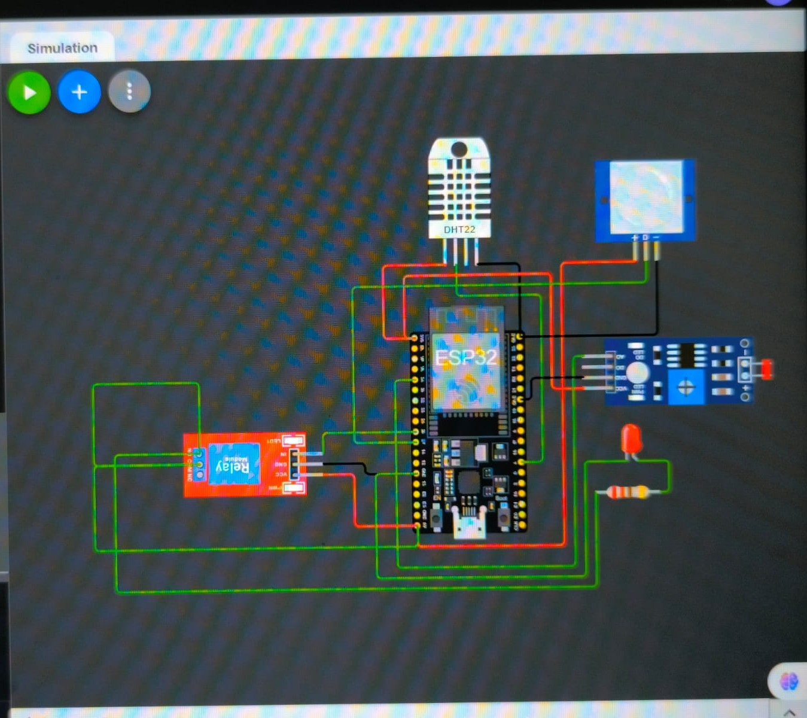
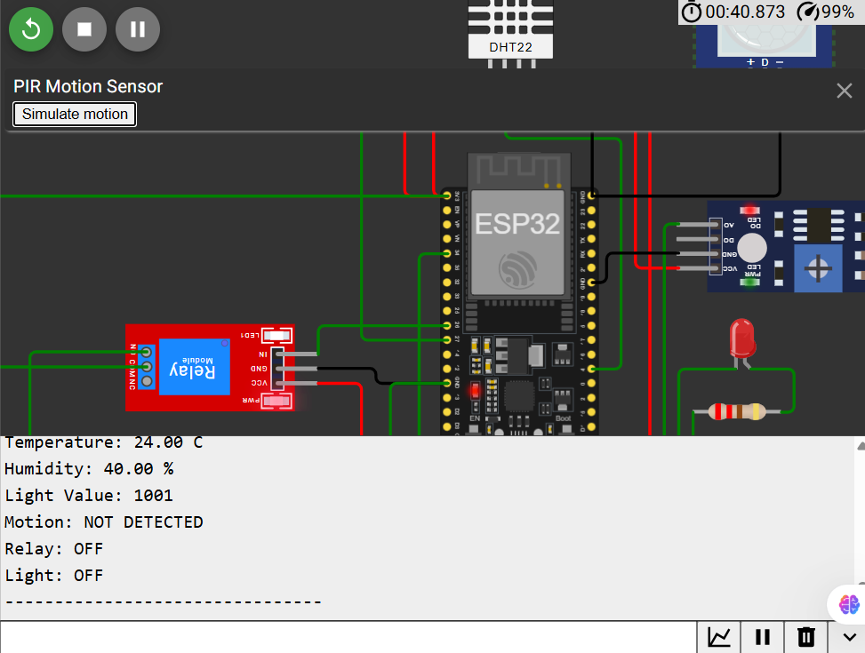
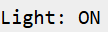

# cognevance_smartHomeAutomation
A Wokwi-simulated ESP32 Smart Home Automation System for temperature, light, and motion monitoring with automatic relay-based appliance control.
# Smart Home Automation System

## Cognevance Technologies – Embedded Systems & IoT Project

A basic Smart Home Automation System developed using ESP32 and simulated using Wokwi. The system monitors temperature, light intensity, and motion and automatically controls a light using a relay based on the detected conditions.

---

## 1. Project Overview

The Smart Home Automation System is an embedded IoT-based automation project designed to demonstrate sensor integration, real-time monitoring, and automatic appliance control.

The ESP32 acts as the main controller. It receives data from a temperature and humidity sensor, light sensor, and PIR motion sensor. Based on the sensor conditions, the ESP32 controls a relay connected to an LED that represents a household light.

The project was developed and tested using the Wokwi online simulation platform.

---

## 2. Objectives

The main objectives of this project are:

- To understand basic embedded systems and IoT concepts.
- To interface multiple sensors with an ESP32.
- To monitor temperature and humidity.
- To detect light intensity using an LDR.
- To detect human motion using a PIR sensor.
- To implement relay-based appliance control.
- To automate a light based on sensor conditions.
- To monitor sensor values using the Serial Monitor.
- To test the complete system using simulation.

---

## 3. System Components

### Hardware / Simulated Components

- ESP32 DevKit
- DHT22 Temperature and Humidity Sensor
- Photoresistor (LDR) Sensor
- PIR Motion Sensor
- Relay Module
- LED
- Resistor
- Connecting wires

### Software / Tools

- Arduino IDE compatible code
- Wokwi Simulator
- Embedded C/C++ programming
- GitHub

---

## 4. System Architecture

The system follows the architecture:

Sensors → ESP32 → Decision Making → Relay → Light

The three sensors provide input to the ESP32:

- DHT22 provides temperature and humidity.
- LDR provides light intensity.
- PIR detects motion.

The ESP32 processes the sensor readings and controls the relay.

---

## 5. Working Principle

The ESP32 continuously reads the values from the connected sensors.

### Temperature and Humidity

The DHT22 sensor measures:

- Temperature
- Humidity

### Light Detection

The LDR provides an analog value corresponding to the illumination level.

### Motion Detection

The PIR sensor detects human movement.

### Automatic Light Control

The system uses the following automation logic:

IF motion is detected AND the room is dark:

    Relay ON
    Light ON

Otherwise:

    Relay OFF
    Light OFF

The LED is used as a simulated household light.

---

## 6. Pin Configuration

| Component | Pin | ESP32 Pin |
|-----------|-----|-----------|
| DHT22 | DATA | GPIO 4 |
| Photoresistor | AO | GPIO 34 |
| PIR | OUT | GPIO 27 |
| Relay | IN | GPIO 26 |
| DHT22 | VCC | 3.3V |
| DHT22 | GND | GND |
| LDR | VCC | 3.3V |
| LDR | GND | GND |
| PIR | VCC | 5V |
| PIR | GND | GND |
| Relay | VCC | 5V |
| Relay | GND | GND |

---

## 7. Circuit Description

### DHT22

The DHT22 data pin is connected to GPIO 4 of the ESP32.

### LDR

The analog output (AO) of the Wokwi photoresistor module is connected to GPIO 34.

### PIR

The output of the PIR motion sensor is connected to GPIO 27.

### Relay

The relay input is connected to GPIO 26.

### LED

The LED represents the household light controlled by the relay.

---

## 8. Automation Logic

The system uses a light threshold to determine whether the environment is dark.

Example:

Light Value < 2000 → Dark

Light Value ≥ 2000 → Bright

When motion is detected in a dark environment, the relay is activated.

---

## 9. Example Sensor Output

Example Serial Monitor output:

Temperature: 24.00 C
Humidity: 40.00 %
Light Value: 839
Motion: DETECTED
Relay: ON
Light: ON

When there is no motion:

Temperature: 24.00 C
Humidity: 40.00 %
Light Value: 839
Motion: NOT DETECTED
Relay: OFF
Light: OFF

---

## 10. Testing

The system was tested under different combinations of motion and light conditions.

| Test Case | Motion | Light Condition | Expected Result | Result |
|-----------|--------|------------------|-----------------|--------|
| 1 | No Motion | Bright | Light OFF | PASS |
| 2 | Motion | Bright | Light OFF | PASS |
| 3 | No Motion | Dark | Light OFF | PASS |
| 4 | Motion | Dark | Light ON | PASS |

---

## 11. Simulation

The complete circuit was designed and tested using Wokwi.

Wokwi was used because physical hardware components were not available during development.

The simulation allowed testing of:

- ESP32 operation
- Temperature and humidity sensing
- Light sensing
- Motion detection
- Relay control
- Automatic light control
- Serial monitoring

Wokwi Project:

(https://wokwi.com/projects/471885796490902529)

---
## 12. Smart Home Automation Circuit

### Smart_Home_Automation_Circuit

The complete ESP32-based smart home circuit is shown below.



## 13. Project Screenshots

### Serial Monitor

Sensor values and system status are displayed through the Serial Monitor.



### Motion Detection

The PIR sensor is used to detect motion.


### Relay and Light Control

The relay controls the LED representing the household light.




## 14. Project Files

The repository is organized into the following folders and files:

```text
src/
    smart_home_automation.ino

circuit/
    smart_home_circuit.png

screenshots/
    Sensor readings, motion detection and relay operation

testing/
    Testing report

documentation/
    Project documentation
